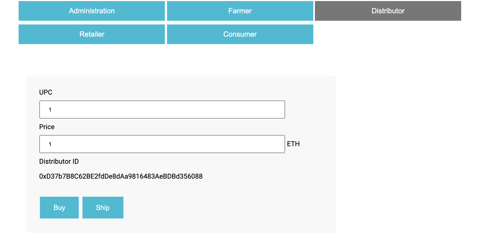
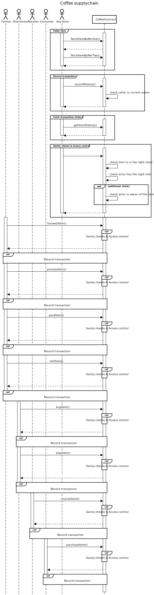
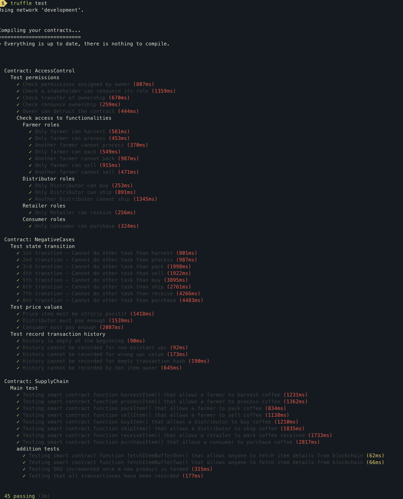

# Supply chain & data auditing

This repository containts an Ethereum DApp that demonstrates a coffee Supply Chain flow between a Seller and Buyer. The user story is similar to any commonly used supply chain process. A Seller can add items to the inventory system stored in the blockchain. A Buyer can purchase such items from the inventory system. Additionally a Seller can mark an item as Shipped, and similarly a Buyer can mark an item as Received.

The DApp User Interface will look like the following:

## User interface

the user interface is built of several sections:

* Role specific section: built of different tabs (Administration, Farmer, Distributor, Retailer, Consumer). For instance: a farmer will click on "Farmer" tab.

  * Administration: here, a contract account owner can assign roles(farmer, distributor, retailer, consumer) to different actors. Only actors who have roles assigned will be able to interact with the contract
  
  

  * Farmer: here, a farmer can harvest an item, process it, pack it then sale it to a distributor
  
  

  * Distributor: here, a distributor can buy coffee from a farmer. he can ship it then to a retailer

  

  * Retailer role: here a retailer can receive coffee from a distributor
  
  
  
  * Consumer role: here a consumer can purchase coffee from a retailer
  
  

* Product overview: "Open" section. Anyone can fetch details of a product


* Transaction history: "Open" section. Anyone can fetch transaction history of a product


* Event logs: "Open" section. Appended in near-real time.These are events coming from Supply chain contract


## UML diagrams

### Actors

* Farmer: harvest , process, package & sells to a distributor
* Distributor: ships the product to the retailer
* Retailer: Mark product as received from distributor then sells the product to a consumer
* Consumer: purchase the product

### State diagram


### Activity diagram


### Sequence diagram



### Class diagram


## Getting Started

These instructions will get you a copy of the project up and running on your local machine for development and testing purposes. See deployment for notes on how to deploy the project on a live system.

### Prerequisites

Please make sure you've already installed ganache-cli, Truffle and enabled MetaMask extension in your browser. This project was tested with the following versions:

* node : v12.22.1
* npm: v6.14.12
* ganache-cli: v6.12.2
* metamask: v9.5.4

### Installing

A step by step series of examples that tell you have to get a development env running

Clone this repository:

```
git clone https://github.com/aelmanaa/udacity-project6-supplychain-dapp.git
```

Change directory to ```project-6``` folder and install all requisite npm packages (as listed in ```package.json```):

```
cd project-6
npm install
```

#### Run installation on your local machine

Launch Ganache:

```
ganache-cli -m "spirit supply whale amount human item harsh scare congress discover talent hamster"
```

Your terminal should look something like this:


In a separate terminal window, Compile smart contracts:

```
truffle compile
```

This will create the smart contract artifacts in folder ```build\contracts```.

Migrate smart contracts to the locally running blockchain, ganache-cli:

```
truffle migrate
```

Test smart contracts:

```
truffle test
```

All tests should pass.




Make sure to configure Metamask to connect to your local blockchain 


In a separate terminal window, launch the DApp:

```
npm run dev
```

You can then access the application on https://localhost:3000 

#### Run in distributed mode:  test blockchain  (Rinkeby) & IPFS for frontend

create an .env file

```
touch .env
```

this file should contain the private key of the contract owner account and Infra key in order to connect to Rinkeby


Migrate smart contracts to the locally running blockchain, ganache-cli:

```
truffle migrate --reset --network rinkeby
```

build frontend application

```
npm run build
```

HTML and javascript files are in ```dist```folder

Use a pinning service which runs several IPFS node in order to get your data retained. You can use https://pinata.cloud/. You can follow the guildeline of: https://docs.ipfs.io/how-to/websites-on-ipfs/single-page-website/#pinning-files

Once you upload the whole  ```dist```folder, your pinning service will look like:


Click then on the name and the frontend will open. You can then connect to Rinkeby network and start interacting with your contract


## Test results

You can view my rinkeby tests on:

* Contract deployment transaction ID: 0xfa249b40a7b5792ed232f51e9495948fe94c8c6161d4ab916fb872f06ce1e888
* Contract address: 0xf0A00cc57bF5e6435B6FB88405229Dd2a9374A22
* Interaction with contract can be found here: https://rinkeby.etherscan.io/address/0xf0A00cc57bF5e6435B6FB88405229Dd2a9374A22
* IPFS dapp: https://gateway.pinata.cloud/ipfs/QmT1U4kCYFYKKsQ1eMGYRR1Fkp8CNYL8cjMAHbTuBn7mxT/


## Built With

* [Ethereum](https://www.ethereum.org/) - Ethereum is a decentralized platform that runs smart contracts
* [IPFS](https://ipfs.io/) - IPFS is the Distributed Web | A peer-to-peer hypermedia protocol
to make the web faster, safer, and more open.
* [Truffle Framework](http://truffleframework.com/) - Truffle is the most popular development framework for Ethereum with a mission to make your life a whole lot easier.

## Acknowledgments

* Solidity
* Ganache-cli
* Truffle
* IPFS
